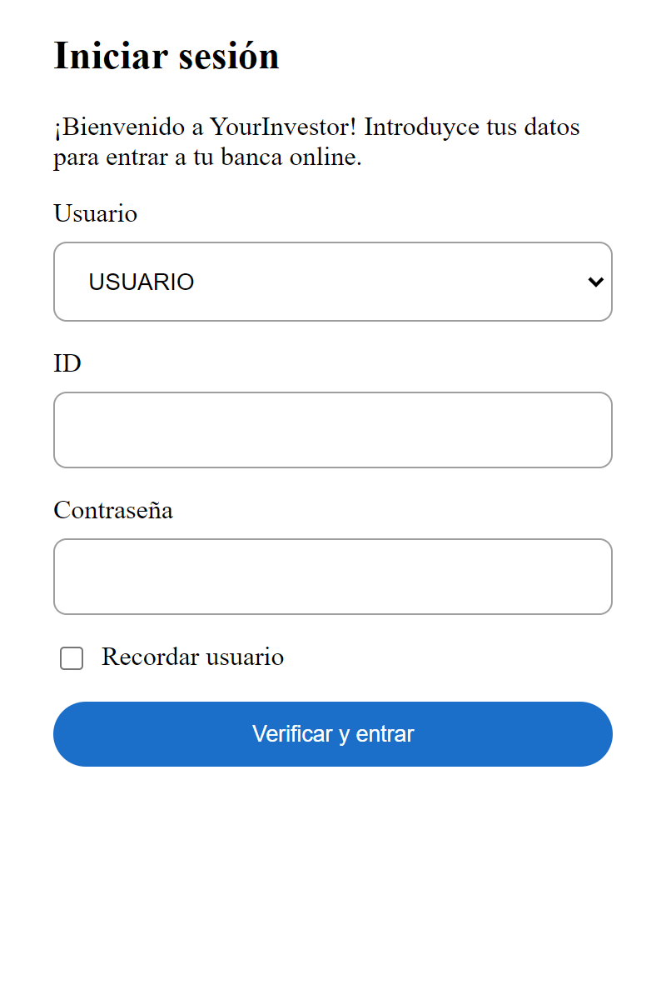
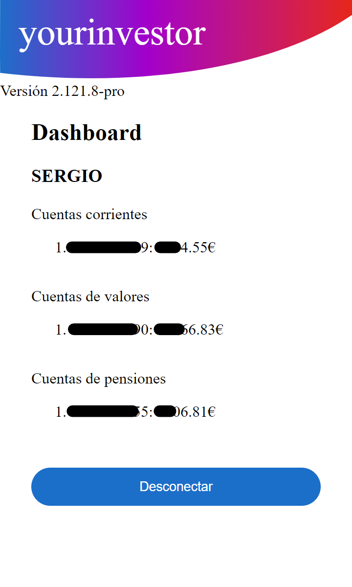

# YourInvestor

This is a personal project to play with different technologies.

_[Vite](https://vitejs.dev/), [vanilla-extract](https://vanilla-extract.style/), [react](https://reactjs.org/), [react-router](https://github.com/remix-run/react-router), [SWR](https://swr.vercel.app/), [express](http://expressjs.com/), [axios](https://axios-http.com/) and a bit of reverse engineering of MyInvestor services._

## Run

1. Run `yarn` to install all the dependencies.
1. Run `node backend/proxy` and **leave it running on the background**.
   This is needed to bypass the web requests from the web client to the MyInvestor backend.
   The web app will talk with this backend.
1. From `/web`, run `yarn dev` to start the frontend.
   Open the URL printed on the console.

## Build and deploy

1. From `/web`, run `yarn build`.
1. From `/backend`:
   1. Start the proxy with `yarn start:proxy`.
   1. Start the web with `yarn start:web ../www`.

## Login

The login also handles the SMS OTP.

## Dashboard

A small demonstration getting the user accounts and rendering their alias or number and the balance.

