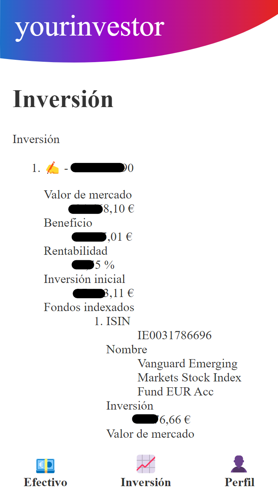

# YourInvestor

This is a personal project to play with different technologies.

_Vite, vanilla-extract, react, react-router, express, axios and a bit of reverse engineering on MyInvestor._

## Run

1. Run `yarn` to install all the dependencies.
1. Run `node backend` and **leave it running on the background**.
   This is needed to bypass the web requests from the web client to the MyInvestor backend.
   The web app will talk with this backend.
   It will print every request from the webapp and response from the MyInvestor backend, for debugging purposes.
1. Run `yarn dev` to start the frontend.
   Open the URL printed on the console.

## Login

The login also handles the SMS OTP.

## Dashboard

A small demonstration getting the user accounts and rendering their alias or number and the balance.

